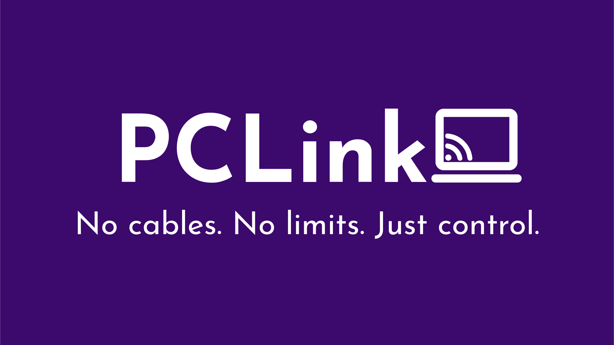

# PCLink Server

**The secure backbone for your personal PC remote control ecosystem.**

---

PCLink is a modern, **web-first** server designed for **secure remote PC management**.  
Featuring a high-performance FastAPI backend, a responsive Web UI, and an extensible plugin system.

[**Download Releases**](https://github.com/BYTEDz/PCLink/releases) • [**Mobile App**](https://play.google.com/store/apps/details?id=xyz.bytedz.pclink) • [**Wiki Portal**](https://github.com/BYTEDz/PCLink/wiki)

---

## 🚀 Quick Start (For Users)

1.  **Download:** Grab the latest installer for your system:
    - **Windows**: [`.exe` installer](https://github.com/BYTEDz/PCLink/releases)
    - **Linux (Ubuntu/Debian)**: [`.deb` package](https://github.com/BYTEDz/PCLink/releases)
    - **Linux (Fedora/RPM)**: [`.rpm` package](https://github.com/BYTEDz/PCLink/releases)
2.  **Setup:** Launch PCLink and open `https://localhost:38080/ui/` in your browser.
3.  **Pair:** Open the **PCLink Mobile App**, scan the QR code from the Web UI, and approve the connection.

👉 **New to PCLink?** Check the [**Installation Guide**](https://github.com/BYTEDz/PCLink/wiki/Getting-Started) for detailed instructions.

---

## 🛡️ Security & Antivirus Notice

PCLink provides powerful system integration (remote input, screen capture, terminal access, and extension support), which can occasionally trigger **False Positive** alerts (e.g., `Wacatac.B!ml`) from some Antivirus software like Windows Defender.

**Rest assured:**

- 🔍 **Always Verified:** Every release is scanned with 70+ AV engines via VirusTotal. Significant flags are extremely rare and inconsistent.
- 🏗️ **Transparent:** The project is fully Open Source. You can inspect every line of code or [build it yourself](https://github.com/BYTEDz/PCLink/wiki/Building-and-Development).
- 📦 **Recommendation:** If you encounter a warning, we recommend using the **`-installer.exe`** version as it has a more robust structure.

---

---

## 🎨 Key Features

- 🌍 **Web-First Management:** Configure your server and manage devices from any browser.
- 🔌 **Extensible Architecture:** Add new features via the [**Extension System**](https://github.com/BYTEDz/PCLink/wiki/Extension-Development).
- 🔒 **Zero-Trust Security:** HTTPS-enforced, manual device approval, and secure session management.
- ⌨️ **Total Input Control:** Remote keyboard, mouse, volume, and media playback sync.
- 📁 **File & Process management:** Full-featured remote file browser and system process manager.
- 🐚 **Modern Shell:** WebSocket-powered terminal access for remote CLI management.

---

## 🏗️ Documentation Hub

We maintain comprehensive guides and technical details in our **[Project Wiki](https://github.com/BYTEDz/PCLink/wiki)**.

| 📚 User Guides                                                                              | 🛠️ Development                                                                         | ⚙️ Reference                                                                   |
| :------------------------------------------------------------------------------------------ | :------------------------------------------------------------------------------------- | :----------------------------------------------------------------------------- |
| 📖 [Getting Started](https://github.com/BYTEDz/PCLink/wiki/Getting-Started)                 | 🏗️ [Build from Source](https://github.com/BYTEDz/PCLink/wiki/Building-and-Development) | 🔌 [API Reference](https://github.com/BYTEDz/PCLink/wiki/API-Endpoints)        |
| 🌐 [Web UI Guide](https://github.com/BYTEDz/PCLink/wiki/Web-UI)                             | 🔌 [Extension SDK](https://github.com/BYTEDz/PCLink/wiki/Extension-Development)        | 🔒 [Security Model](https://github.com/BYTEDz/PCLink/wiki/Server-Architecture) |
| ⚠️ [Troubleshooting](https://github.com/BYTEDz/PCLink/wiki/Getting-Started#troubleshooting) | 🤝 [Contributing](https://github.com/BYTEDz/PCLink/wiki/Contributing)                  | ⚡ [Quick Commands](https://github.com/BYTEDz/PCLink/wiki/Quick-Reference)     |

---

## 🌐 The Ecosystem

- 🏠 **[PCLink Server](https://github.com/BYTEDz/PCLink)** (This Repo) - The core backend service.
- 📱 **[PCLink Mobile](https://play.google.com/store/apps/details?id=xyz.bytedz.pclink)** - Companion app for Android.
- 📦 **[PCLink Extensions](https://github.com/BYTEDz/pclink-extensions)** - Official repository for community extensions.

---

## 📈 Activity & Growth

---

## 🤝 Support & Maintainers

### [Azhar Zouhir](https://github.com/AzharZouhir)

**Creator & Lead Developer**

_Building the next generation of PC remote management._

---

🕊️ Free Palestine • 🇩🇿 Made with ❤️ in Algeria

