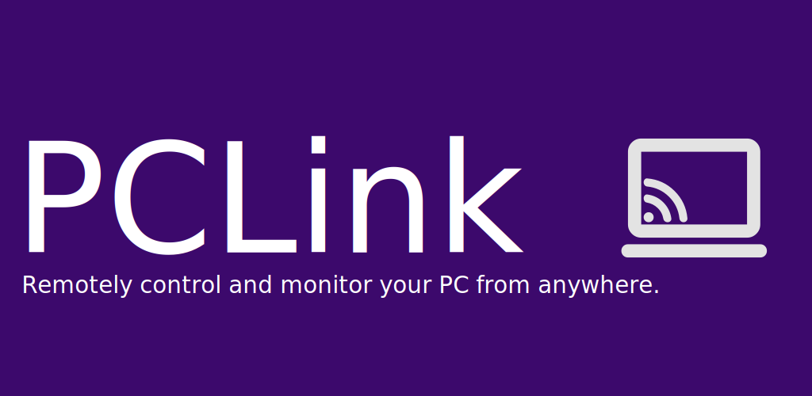

<div align="center">



[](https://www.gnu.org/licenses/agpl-3.0)
[](https://github.com/BYTEDz/PCLink)
[](https://www.python.org/)
[](https://github.com/BYTEDz/PCLink/releases)
[](https://play.google.com/store/apps/details?id=xyz.bytedz.pclink)

</div>

---

<div align="center">

**PCLink** is a modern, **web-first** application for **secure remote PC control** from mobile devices.  
It features a **FastAPI server**, **responsive web interface**, and **lightweight system tray**.

</div>

**Created by [Azhar Zouhir](https://github.com/AzharZouhir) / BYTEDz**

> 📱 **Need the mobile app?** Get it at [Google Play Store](https://play.google.com/store/apps/details?id=xyz.bytedz.pclink)

---

## 🚀 Features

### 🌐 Web-First Interface
- **Modern Web UI**: Responsive, dark-themed control panel
- **Real-time Updates**: WebSocket-powered live data
- **QR Code Pairing**: Visual device pairing with actual QR codes
- **Cross-Platform**: Works on any device with a browser
- **No Dependencies**: Zero Qt/GUI library requirements

### 🔧 Core Functionality
- **Remote Control**: File browser, process manager, terminal access
- **Media & Input**: Media playback, keyboard/mouse input, clipboard sync
- **System Actions**: Shutdown, restart, volume control, system info
- **Screen Capture**: Remote screenshots
- **Device Management**: Pairing, approval, and revocation

### 🔒 Security & Authentication
- **Web UI Authentication**: Password-protected interface with sessions
- **HTTPS Only**: Auto-generated self-signed certificates
- **API Key Authentication**: Secure device access
- **Session Management**: 24-hour sessions with automatic cleanup
- **Secure Pairing**: QR code-based device authentication

## 💻 System Requirements

### ✅ Tested Platforms
- **Windows 10/11** - Full support with system tray and power management
- **Linux Mint 22.1 Xia** - Complete integration with AppIndicator tray and systemd

### 🔧 Requirements
- **Python 3.8+** (automatically handled in packaged installations)
- **Network access** for mobile device communication
- **Administrator privileges** for power management features (optional)

### 📦 Installation Methods
- **Windows**: `.exe` installer with automatic setup
- **Linux**: `.deb` package with proper system integration  
- **Cross-platform**: Python wheel (`.whl`) for pip installation
- **Development**: Direct GitHub installation via pip

### 💻 Deployment Options
- **Web-Only Mode**: Modern interface with system tray (default)
- **Headless Mode**: Background server for automation
- **Legacy Qt Mode**: Traditional desktop interface (optional)
- **Cross-Platform**: Windows and Linux with full system integration

### 🛠️ Developer Experience
- **Lightweight**: Minimal dependencies, fast startup
- **Modular API**: Router-based FastAPI endpoints
- **Easy Deployment**: Single command installation
- **Extensible**: Clean architecture for customization

---

## 📱 Mobile App Required

The server requires the companion mobile app:

- 🌐 [Official Website](https://bytedz.xyz/products/pclink/)
- 📱 [Google Play](https://play.google.com/store/apps/details?id=xyz.bytedz.pclink)  
- 🍎 iOS: Coming soon

---

## 🛠️ Installation

### 🚀 Recommended: Native Packages

#### Windows 10/11
1. Download the latest `.exe` installer from [Releases](https://github.com/BYTEDz/PCLink/releases)
2. Run the installer with administrator privileges
3. PCLink will be available in Start Menu and system tray

#### Linux Mint 22.1 / Ubuntu-based
1. Download the latest `.deb` package from [Releases](https://github.com/BYTEDz/PCLink/releases)
2. Install: `sudo dpkg -i pclink_*.deb`
3. Fix dependencies if needed: `sudo apt-get install -f`
4. Start: `pclink` or find in applications menu

### 🐍 Alternative: Python Wheel (Cross-Platform)

For users who prefer pip installation or need cross-platform compatibility:

```bash
# Download the .whl file from Releases, then:
pip install pclink-2.1.0-py3-none-any.whl

# Or install directly from GitHub (latest):
pip install git+https://github.com/BYTEDz/PCLink.git

# Run PCLink
pclink
```

**Note**: Wheel installation requires manual setup of system dependencies on Linux (AppIndicator, etc.)

### 🎛️ Usage

```bash
# Start PCLink (opens web interface automatically)
pclink

# Background/startup mode (system tray only)
pclink --startup

# Don't auto-open browser
pclink --no-browser

# Test power command permissions (Linux)
test-power-permissions
```

### 🔧 First Time Setup
1. **Set Web UI Password**: Access https://localhost:8000/ui/ and create a password
2. **Pair Mobile Device**: Scan the QR code with the PCLink mobile app
3. **Configure Startup**: Enable "Start with system" in web UI settings

### 📱 Mobile App Required
PCLink requires the companion mobile app to function:
- **Android**: [Google Play Store](https://play.google.com/store/apps/details?id=xyz.bytedz.pclink)
- **iOS**: Coming soon

### Development Setup

```bash
git clone https://github.com/BYTEDz/PCLink.git
cd PCLink

# For developers only - use native packages for production
```

### Manual Setup

```bash
git clone https://github.com/BYTEDz/PCLink.git
cd PCLink

# Create and activate virtual environment (recommended)
python3 -m venv pclink-env
source pclink-env/bin/activate  # Linux
# or: pclink-env\Scripts\activate  # Windows

# Install dependencies and PCLink
pip install -r requirements.txt
pip install -e .

# Run PCLink
python -m pclink
```

### Development Setup

```bash
# With virtual environment activated
pip install -e ".[dev]"
pre-commit install
pytest
```

### Launcher Commands

```bash
# For end users (recommended)
pipx install git+https://github.com/BYTEDz/PCLink.git
pclink                                 # Run PCLink

# Build packages
python scripts/build.py --format installer   # Windows installer
python scripts/build_fpm.py                  # Linux .deb package

# Other commands
pclink.bat --test                     # Run tests
pclink.bat --clean                    # Clean environment
```

### Manual Build Commands

#### Windows
```bash
# With virtual environment activated
python scripts/build.py --format portable    # ZIP archive
python scripts/build.py --format onefile     # Single EXE
python scripts/build.py --format installer   # Windows installer
```

#### Linux
```bash
# With virtual environment activated
python scripts/build.py --format fpm         # Native packages (DEB + RPM)
```

**Note**: Flatpak is not supported as PCLink requires deep system access incompatible with sandboxing.

**Note**: Linux builds require virtual environment due to PEP 668 protection on modern distributions.

### 🔒 Why pipx is Recommended

**pipx** is the safest way to install PCLink:
- ✅ **Isolated** - Won't conflict with system Python packages
- ✅ **Clean** - Easy to uninstall completely (`pipx uninstall pclink`)
- ✅ **Global** - `pclink` command available system-wide
- ✅ **Secure** - No dependency pollution or version conflicts
- ✅ **Updatable** - Simple updates with `pipx upgrade pclink`

Perfect for system tools like PCLink that need full system access but isolated Python environment.

### 🌐 Web Interface Benefits

**No More Dependency Issues:**
- ✅ **Zero Qt Dependencies**: Works without any GUI libraries
- ✅ **Universal Compatibility**: Runs on any system with Python
- ✅ **Remote Access**: Manage PCLink from any device on your network
- ✅ **Modern UI**: Responsive design that works on desktop and mobile
- ✅ **Easy Updates**: Just HTML/CSS/JS files, no compilation needed

**Cross-Platform System Tray:**
- Uses lightweight `pystray` instead of Qt
- Works on Windows and Linux with native system tray integration
- Right-click menu for server control
- System notifications for events

**Automatic Fixes:**
- **Networking**: Auto-configures firewall rules and network interfaces
- **Certificates**: Generates HTTPS certificates automatically  
- **IP Detection**: Shows real local IP addresses (192.168.x.x) in QR codes
- **Fallback Modes**: Graceful degradation if components fail

---

## 🏗️ Architecture

### 🌐 Web-First Stack

* **Frontend**: Modern HTML5/CSS3/JavaScript with WebSocket
* **Backend**: FastAPI + Uvicorn ASGI server
* **Authentication**: Session-based with PBKDF2 password hashing
* **System Tray**: Cross-platform `pystray` (lightweight)
* **Security**: HTTPS + API keys + web authentication
* **Packaging**: Minimal dependencies, easy deployment

### 📁 Project Structure

```
src/pclink/
├── api_server/      # FastAPI routers + WebSocket handlers
├── core/            # Controller, auth, config, security
├── web_ui/          # Modern web interface (HTML/CSS/JS)
│   └── static/      # Web assets, authentication pages
├── web_ui/          # Web interface (default)
└── assets/          # Icons and resources
```

### 🔧 Key Components

* **Web Authentication**: Secure password-based access control
* **WebSocket Real-time**: Live updates for system info and pairing
* **Lightweight Tray**: Cross-platform system tray without Qt
* **Modular API**: Clean separation of concerns
* **Session Management**: Secure 24-hour sessions with cleanup

### 🛠️ API Endpoints

**Public:**
- `/ui/` - Web interface (with auth)
- `/auth/*` - Authentication endpoints
- `/status` - Server health check

**Protected (API Key):**
- `/system/*` - Power, volume, processes
- `/info/*` - System and media information  
- `/input/*` - Remote keyboard/mouse control
- `/media/*` - Playback control
- `/files/*` - File browser and operations
- `/terminal/*` - WebSocket shell access
- `/ws` - WebSocket for real-time communication

**Web UI (Session Auth):**
- `/devices` - Connected device management
- `/logs` - Server log viewing
- `/qr-payload` - QR code generation data

---

## 🔒 Security

### 🌐 Web Interface Security
* **Password Authentication**: PBKDF2-hashed passwords with salt
* **Session Management**: Secure HTTP-only cookies with 24-hour timeout
* **IP Validation**: Session tied to client IP address
* **Automatic Cleanup**: Expired sessions automatically removed

### 📱 Mobile Device Security  
* **HTTPS Only**: Encrypted communication with auto-generated certificates
* **API Key Authentication**: Unique keys per device
* **Device Approval**: Manual pairing approval required
* **QR Code Pairing**: Secure visual pairing process
* **Device Revocation**: Instant access removal capability

### 🛡️ System Security
* **Single Instance**: Prevents multiple server conflicts
* **Local Certificates**: Self-signed HTTPS certificates
* **No HTTP Fallback**: HTTPS enforcement
* **Secure Defaults**: All security features enabled by default

---

## 📄 License

**GNU AGPL v3** – Free to use, modify, and distribute.
⚠️ Proprietary services must open-source modifications.
For commercial licensing, contact BYTEDz.

---

## 📞 Support

* **Support**: [support@bytedz.xyz](mailto:support@bytedz.xyz)
* **Website**: [bytedz.xyz/products/pclink](https://bytedz.xyz/products/pclink/)
* **Developers**: [GitHub Issues](https://github.com/BYTEDz/PCLink/issues) • [Discussions](https://github.com/BYTEDz/PCLink/discussions)

---

## 👥 Maintainers

<table>
  <tr>
    <td align="center">
      <a href="https://github.com/AzharZouhir">
        
        <br />
        <sub><b>Azhar Zouhir</b></sub>
      </a>
      <br />
      <sub>Creator & Lead Developer</sub>
      <br />
      <a href="mailto:support@bytedz.xyz">📧</a>
      <a href="https://github.com/AzharZouhir">💻</a>
    </td>
  </tr>
</table>

---

<div align="center">

🕊️ Free Palestine • 🇩🇿 Made with ❤️ in Algeria

</div>